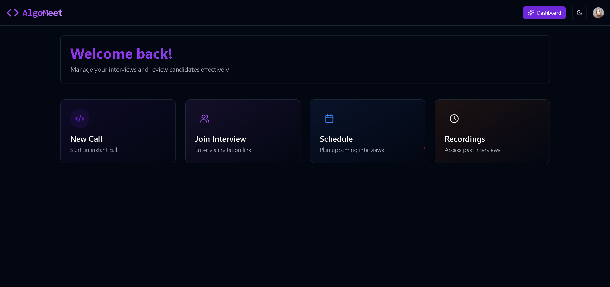
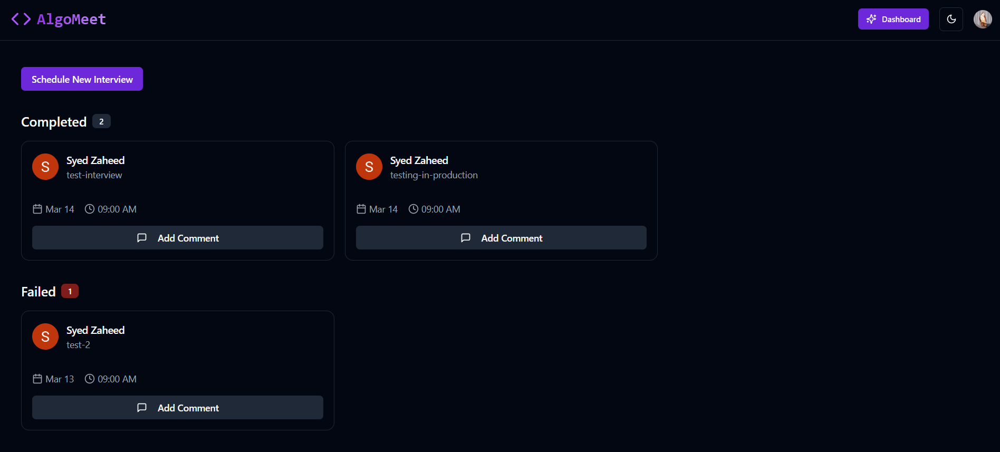
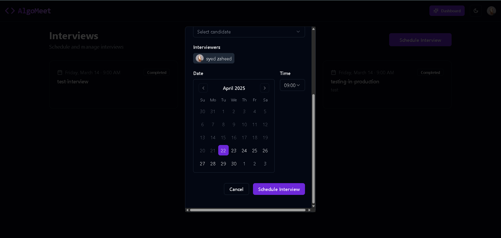
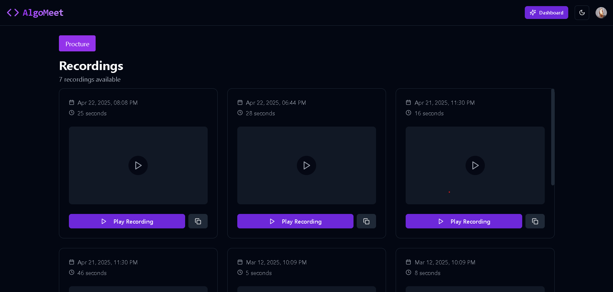
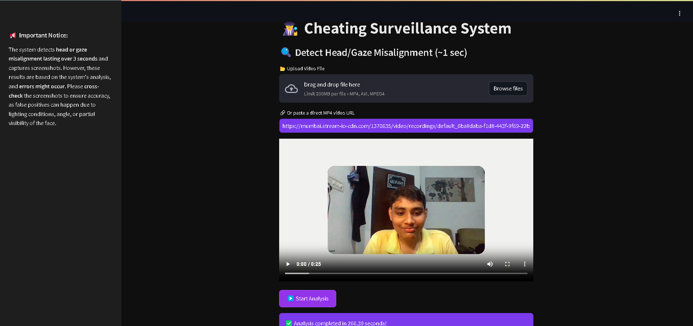
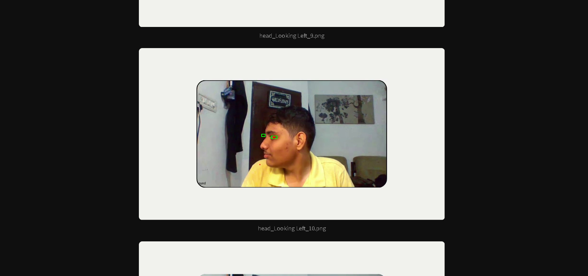
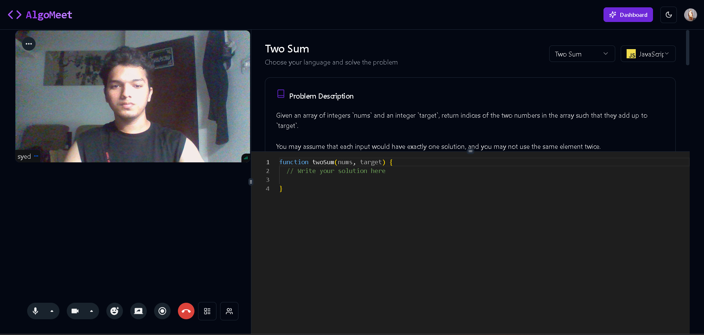
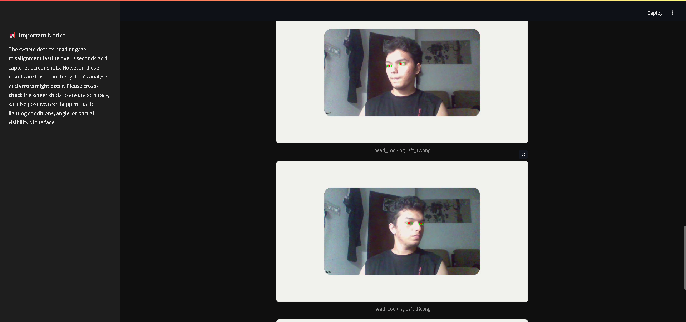

Here’s the enhanced version of your `README.md` with **image placeholders** (you can replace them with actual image links later) and some layout improvements for clarity and polish:

---

## 📌 AlgoMeet

**AlgoMeet** is a surveillance-integrated platform to conduct real-time or scheduled coding interviews with cheating detection features using head and gaze alignment monitoring.

<p align="center">
  
</p>

---

### 🚀 Features

- ✅ **Instant or Scheduled Interviews**  
- 🧑‍💻 **Live Coding with Camera On**  
- 🧠 **AI-based Cheating Detection (Face/Gaze Misalignment)**  
- 🎥 **Auto-recording of Sessions**
- 🖼️ **Screenshot Logging for Violations**

---

### 🖼️ Sample UI Screenshots

#### 🔹 Homepage / Dashboard
<p align="center">
  
</p>

#### 🔹 Schedule Page
<p align="center">
  
</p>

#### 🔹 Recordings Page
<p align="center">
  
</p>


#### 🔹 Surveillance Input (Screenshots)
<p align="center">
  
</p>

#### 🔹 Surveillance Output (Screenshots)
<p align="center">
  
</p>

#### 🔹 Code Editor + Camera Overlay
<p align="center">
  
</p>

---

### 📊 Surveillance System Highlights

- **Head Tilt & Gaze Detection** using MediaPipe + OpenCV.
- Screenshots are saved **only if misalignment > 7 seconds**.
- Designed for **low false positives** but may still depend on:
  - Lighting
  - Camera angle
  - Visibility

<p align="center">
  
</p>

---

### ⚙️ Tech Stack

| Layer        | Tech Used                    |
|--------------|------------------------------|
| Frontend     | Next.js, ShadcnUI      |
| Backend      | Node.js          |
| Surveillance | Python, OpenCV, YOLOv8
| App Platform | Streamlit (for video analysis)|
| Real-time    | WebRTC                       |
| Database     | Convex                     |

---

### 🛠️ Local Setup

#### 1. 🔧 Prerequisites

- Node.js + npm
- Python 3.8+
- MongoDB (local/cloud)
- Streamlit installed

#### 2. 💻 Run Frontend

```bash
cd frontend
npm install
npm run dev
```

#### 3. 🧠 Run Backend

```bash
cd backend
npm install
node index.js
```

#### 4. 👁️ Run Surveillance App

```bash
cd surveillance
pip install -r requirements.txt
streamlit run app.py
```

---

### 🧪 Demo Recordings (Mocked)

| Date         | Duration |
|--------------|----------|
| Apr 22, 2025 | 25s      |
| Apr 21, 2025 | 45s      |
| Mar 12, 2025 | 11s      |

---

### 🤝 Collaborators

| Name     | Role                 |
|----------|----------------------|
| You      | Full Stack Developer |
| Add more | Backend / AI / etc.  |

---

### ⚠️ Disclaimer

The surveillance system may yield false positives due to lighting, face angle, or occlusion. Always **manually verify screenshots** before taking any action.

---

Let me know if you’d like:
- Me to extract frames from your uploaded images to use in this `README.md`
- Help optimizing assets (compressing/resizing images)
- To generate badge icons (e.g. `Made with ❤️`, `MIT License`, etc.)

Just drop the images you want embedded, or I can extract from the WhatsApp screenshots you've shared.
